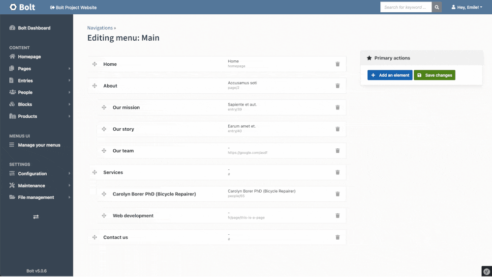

# Bolt Navigations UI

A Bolt CMS extension that adds a visual interface to update menus in Bolt's admin dashboard.

It allows end-users to update menus intuitively via a drag-and-drop interface, and to add links with a simple content search engine.



---

## Installation

To get started, first make sure you're running PHP 7.4 or higher, as well as Bolt 4 or higher.

Then, in your project, install the extension via Composer:

```bash
composer require eckinox/bolt-navigation-ui
```

Once that's done, you're all set: you can now edit your menus via the new visual interface!

---

## License

This extension is distributed by [Eckinox](https://www.eckinox.ca/) with an MIT license.
